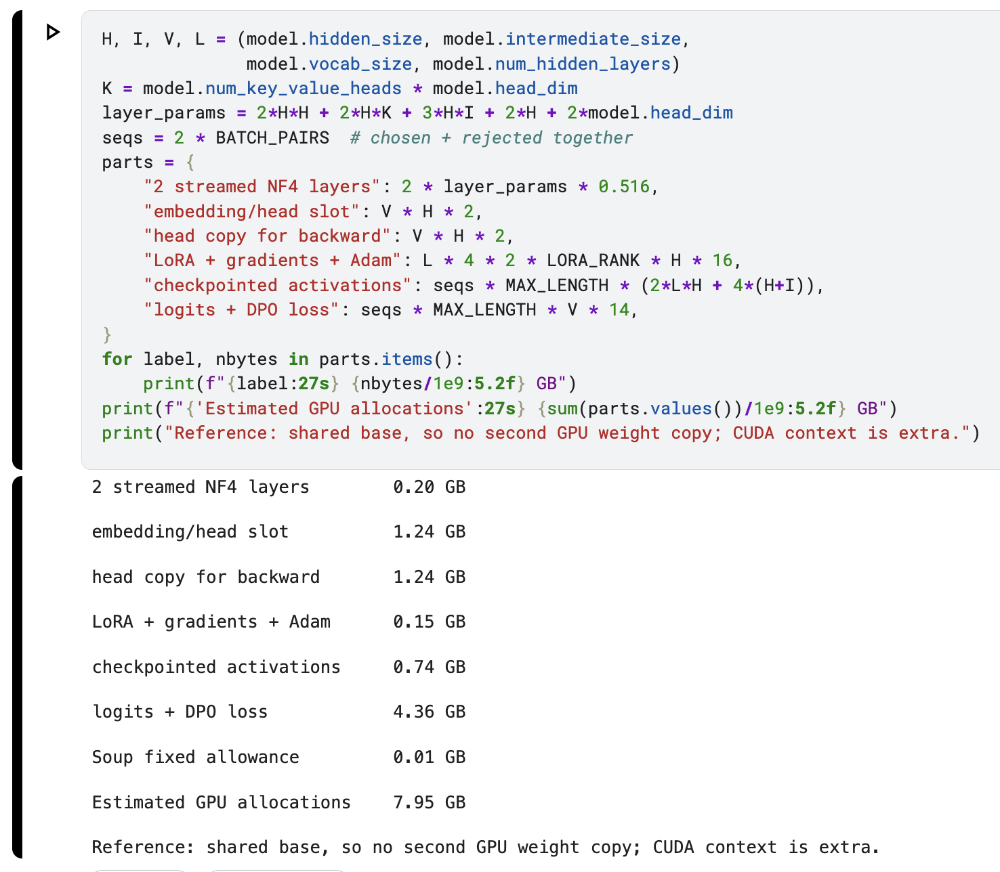

## Dataset

As a foundation for real, messy Russian data I used a mail.ru "https://www.kaggle.com/datasets/atleast6characterss/otvetmailru-full" dataset. But I had to edit answers to get response pairs that will contrast each other in a way. In our case: politeness vs rudeness (often subtle).
So the data is half-synthetic. I iteratively used multiple blind AI judges/editors to make the data diverse and high-quality across all rows.

## 1. Memory budget and hardware

Before training, I estimated 7.95 GB of live GPU allocations, which sounded OK for 4-bit Qwen-3 9B.

During the final run, Soup reported ~6.4 GiB, while `nvidia-smi` sampling peaked at 14.38 GiB (~95% of the T4). Why do they differ so much? Well, Soup reports memory occupied by PyTorch tensors. `nvidia-smi` samples total memory used on the GPU, including PyTorch's cached blocks and CUDA overhead; other processes can contribute too. I forgot to record `torch.cuda.max_memory_reserved()` inside Soup's training process, so I cannot dig deeper unfortunately.

## 2. Proving that training was real

My verification has two parts. First, it loads the saved adapter and compares every LoRA-B tensor with our frozen initial adapter. All 72 tensors changed, became nonzero, and remained finite.
Second, I tested all 50 held-out pairs after reloading, with the adapter on and off, to measure its effect on preference for the chosen answer. The median absolute margin change was 5.314, above the verification threshold of 0.01, and 49/50 pairs shifted toward the chosen answer. Preference accuracy increased from 50% (25/50) to 60% (30/50).

Together, these checks can establish saved parameter updates and adapter activity. Falling training loss alone cannot: it does not show whether the saved adapter still changes the model after reloading. Neither check proves that answer quality improved beyond these pairs.

## 3. Silent failures

I checked against these possible silent failures too:
- **Invalid gradients:** raw logs preserve every reported gradient norm. 187/189 were finite and 2/189 were NaN. Well, not great but close.
- **Bad input:** Soup validation and lint returned OK; doctor returned `MINOR` because of a chat template without `` markers.

what happened to me unexpectedly:

- **Autograd troubles:** we were overwriting the output-head weights before backward finished. I had to clone the output head to give autograd the stable storage.

## 4. Verdict

SHIP.

My testing showed significant results for OOF pairs (50% -> 60% preference for chosen). However, ship metrics like safety, refusal, etc did not move. I guess the model didn't change globally but learned a niche preference for politeness in Russian or something in that vein.

However, I am concerned about memory usage, estimations were off hugely and proper measurements weren't done; but we didn't get hit by OOM anyways. Also I was surprised by some sudden bugs. For example I was surprised that layer streaming could overwrite weights still needed for backward. But overall this task was fun to do.
